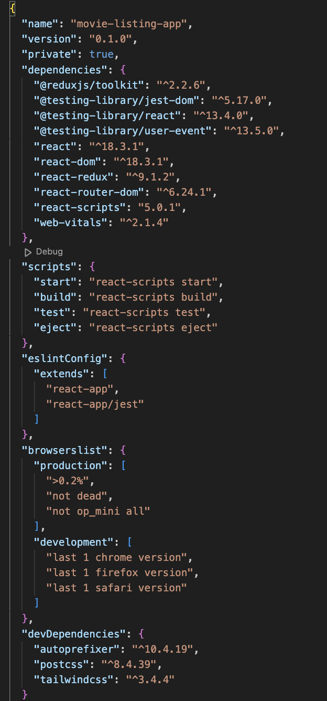
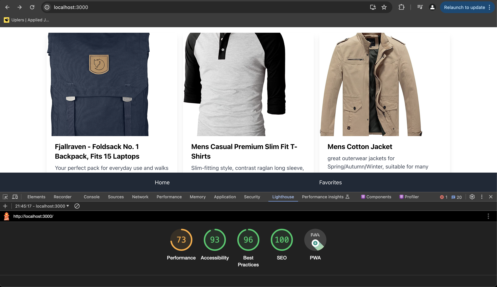

# Getting Started with Create React App

This project was bootstrapped with [Create React App](https://github.com/facebook/create-react-app).

## Available Scripts

In the project directory, you can run:

### `npm start`

Runs the app in the development mode.\
Open [http://localhost:3000](http://localhost:3000) to view it in your browser.

The page will reload when you make changes.\
You may also see any lint errors in the console.

### Packages used

### Performance

### To do
1. Use movies list api
2. Implement admin page
3. Fix styling of all the components
4. Add test cases
5. Make the web pages responsive
6. Improve performance

### Points to consider:
1. Api of product list is used.
2. Basic functionality is implemented.
3. Styling can be improved. Basic styling is implemented. 

